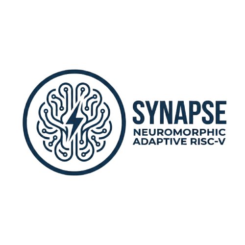

<p align="center">
  <!-- Put your final logo at: docs/figs/logo.png -->
  
</p>

<h1 align="center">SYNAPSE</h1>
<p align="center"><b>Neuromorphic Adaptive-Precision RISC-V Core (RV32)</b></p>
<p align="center">
  Real-time precision scaling (16/32/64) with neuronal-state control, hysteresis, and refractory stabilization.
</p>

<p align="center">
  <!-- Optional badges (edit links once you publish) -->
  <!-- <a href="https://github.com/<you>/<repo>/actions">/<repo>/ci.yml" /></a> -->
  <!--  -->
  <!--  -->
</p>

---

## TL;DR
**SYNAPSE** is a from-scratch **RV32** processor core with a **Neuromorphic Adaptive Dynamic Precision Scaling (ADPS)** controller that selects **16/32/64-bit execution width at runtime** using a bio-inspired state model, plus **hysteresis + refractory** logic to prevent oscillations. In our FPGA prototype, ADPS demonstrates **measurable energy savings (~12–15%) with <1% overhead** while maintaining ISA compatibility. :contentReference[oaicite:0]{index=0}

<p align="center">
  <!-- Put your architecture diagram here -->
  
</p>

---

## Table of Contents
- [Why this core](#why-this-core)
- [Key Ideas](#key-ideas)
- [Architecture](#architecture)
- [Repository Layout](#repository-layout)
- [Quick Start](#quick-start)
  - [Prerequisites](#prerequisites)
  - [Simulation](#simulation)
  - [FPGA Build (Zybo Z7)](#fpga-build-zybo-z7)
- [ADPS: Neuromorphic Precision Scaling](#adps-neuromorphic-precision-scaling)
  - [Precision States](#precision-states)
  - [Decision Function](#decision-function)
  - [Stability: Hysteresis & Refractory](#stability-hysteresis--refractory)
- [Control/Status Registers (CSRs)](#controlstatus-registers-csrs)
- [Benchmarks & Methodology](#benchmarks--methodology)
- [Results](#results)
- [Roadmap](#roadmap)
- [Contributing](#contributing)
- [Citation](#citation)
- [License](#license)
- [Acknowledgements](#acknowledgements)

---

## Why this core
Fixed precision wastes energy when the full datapath width isn’t needed. SYNAPSE treats **precision selection like a biological process** (neuronal states) and adapts per instruction using operand/context cues, while guarding against rapid switching (“flapping”). :contentReference[oaicite:1]{index=1}

---

## Key Ideas
**What makes SYNAPSE different:**
- **Neuromorphic decision engine** chooses 16/32/64-bit width dynamically with stabilization. :contentReference[oaicite:2]{index=2}
- **Reconfigurable sliced ALU**: four 16-bit lanes configure as **4×16, 2×32, 1×64** via precision tags. :contentReference[oaicite:3]{index=3}
- **PUU IN / PUU OUT** preserve RV32 architectural semantics while enabling internal wider execution. :contentReference[oaicite:4]{index=4}
- **Software control & observability via CSRs**, enabling tuning and profiling. :contentReference[oaicite:5]{index=5}

---

## Architecture
At a high level:
- **RV32 core**: fetch/decode/execute/mem/writeback (implementation may be single-cycle or pipelined depending on your RTL branch).
- **PUU IN/OUT**: packs/unpacks architectural RV32 values into internal representation and back.
- **Sliced ALU**: precision-tag driven lane chaining.
- **ADPS controller**: monitors operands + instruction context and emits `p_tag`.

Paper-aligned precision tag mapping: :contentReference[oaicite:6]{index=6}
- `p_tag=00` → **4×16**
- `p_tag=01` → **2×32**
- `p_tag=10` → **1×64**

---

## Repository Layout
> Adjust names to your repo exactly; keep this section accurate.

```text
.
├── rtl/
│   ├── core/                 # RV32 core: control/datapath/regfile/pc/etc.
│   ├── adps/                 # ADPS controller + CSR block
│   ├── alu/                  # sliced ALU + lane chaining
│   ├── mem/                  # IMEM/DMEM models
│   └── top/                  # FPGA top + wrappers
├── sim/
│   ├── tb/                   # testbenches
│   ├── vectors/              # directed tests / reference outputs
│   └── Makefile
├── fw/
│   ├── tests/                # bare-metal test programs
│   └── Makefile
├── fpga/
│   └── zybo_z7/              # XDC + Vivado TCL
├── docs/
│   ├── figs/                 # logo + diagrams
│   └── paper/                # PDF + bibtex
└── README.md
